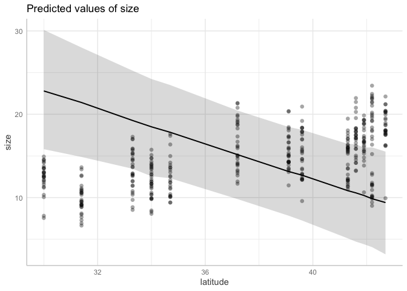
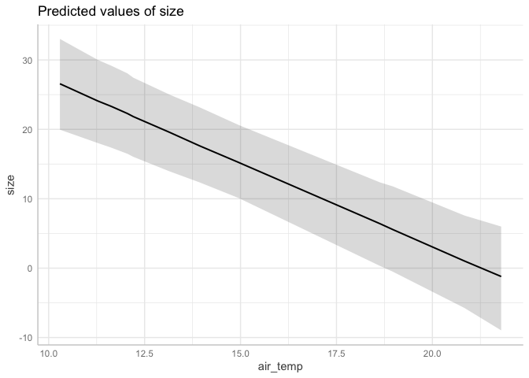
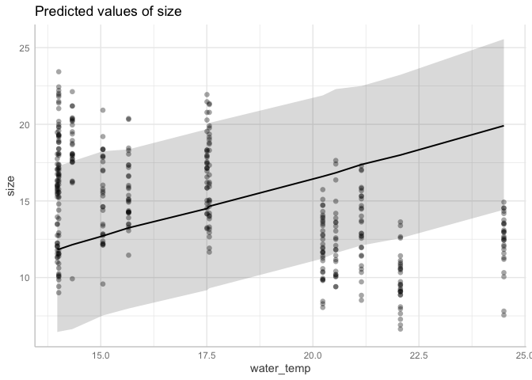
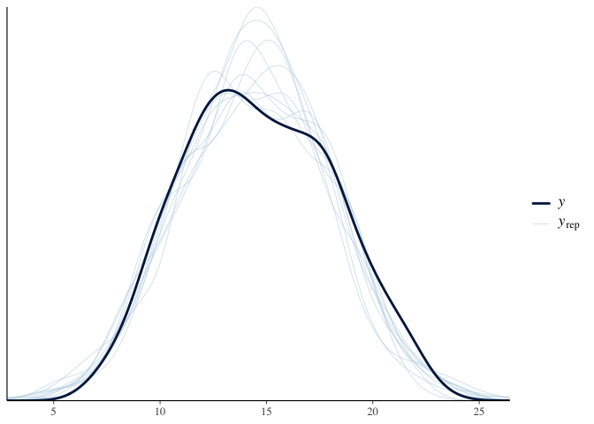
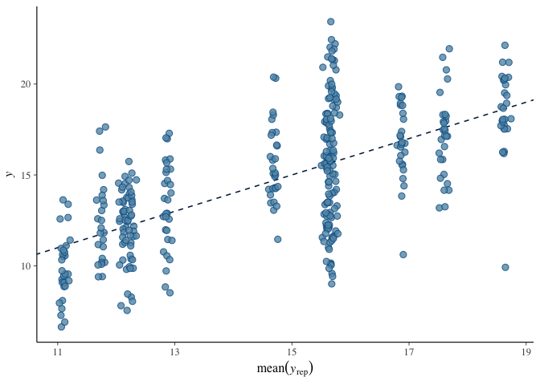

Activity 12: Statistical reasoning 4: prediction and evaluation
================


Welcome! This is the fourth statistical reasoning activity. The goals of
this activity are to understand how to evaluate and compare the
predictive accuracy of multiple models. Specifically, you will:

- Run and interpret multiple models on the same dataset and evaluate
  them to see which is best supported using WAIC and PSIS.

------------------------------------------------------------------------

You will submit one output for this activity:

1.  A **PDF** of a rendered Quarto document with all of your R code.
    Please create a new Quarto document (e.g. don’t use this
    `README.qmd`) and include all of the code that appears in this
    document, your own code, and **answers to all of the questions** in
    the “Q#” sections. Submit this PDF through Gradescope.

A reminder: **Please label the code** in your final submission in two
ways:

1.  denote your answers to each question using headers that correspond
    to the question you’re answering, and
2.  thoroughly “comment” your code: remember, this means annotating your
    code directly by typing descriptions of what each line does after a
    `#`. This will help future you!

------------------------------------------------------------------------

# 1. Practice with model comparison

------------------------------------------------------------------------

By making models, we are trying to approximate the processes that affect
things in a system. It’s important to know how well our models are
actually aligning with reality though. If we are not careful, we may
“overfit” our models. *Overfitting* is when our model fits the data too
closely, usually because we added too many parameters, which explains
the data well but makes the model very bad at predicting future data
(for instance, the final panel of the XKCD comic below).


It is common in the field of ecology to have multiple candidate models
of how a system works. How do we know which is “best” at making
predictions? In this activity we will learn two metrics that can help:
the Watanabe–Akaike information criterion (**WAIC**) and Pareto Smoothed
Importance Sampling (**PSIS**).

Both metrics tell us how well the model will predict data it wasn’t
trained on, which is important for thinking about how well the model
might predict new data that we as scientists have not encountered yet.

------------------------------------------------------------------------

Let’s start by reading in the relevant packages

``` r
library(brms) # for statistics
library(tidyverse) # for data wrangling
library(lterdatasampler)
```

We are going to work with the fiddler crab and latitude data again:

``` r
pie_crab <- lterdatasampler::pie_crab
```

------------------------------------------------------------------------

In this section, we will run and interpret three multiple regressions to
try and understand what influences crab body width in mm (`size`). These
are data from crabs (\~30 per site) collected from sites from Florida to
Massachusetts. Let’s remind ourselves of the columns in the crab data:

``` r
colnames(pie_crab)
```

    [1] "date"          "latitude"      "site"          "size"         
    [5] "air_temp"      "air_temp_sd"   "water_temp"    "water_temp_sd"
    [9] "name"         

We have multiple temperature variables that may be relevant to crab body
size here, all measured in degrees Celsius. Mean annual air and water
temperature data (`air_temp`, `water_temp`), plus the standard
deviations of each (`air_temp_sd` and `water_temp_sd`, representing
variability in temperature and perhaps seasonality).

------------------------------------------------------------------------

## 1.1 Create hypotheses for how each variable may affect crab size

Create four separate hypotheses describing how each predictor would be
associated with larger or smaller crabs. Why? Please write 2-3 sentences
for each predictor.

------------------------------------------------------------------------

### Q1.1a How might *mean* annual *water* temperature affect crab size?

------------------------------------------------------------------------

### Q1.1b How might *mean* annual *air* temperature affect crab size?

------------------------------------------------------------------------

### Q1.1c How might the *sd* (variability) of *water* temperature affect crab size?

------------------------------------------------------------------------

### Q1.1d How might the *sd* (variability) of *air* temperature affect crab size?

------------------------------------------------------------------------

## 1.2 Run, assess, and interpret three multiple regressions with latitude and *mean* temperatures

Let’s run three regressions and compare their results. We will start by
looking at how body size varies with latitude plus each of the mean
temperature values separately, then together. Since these are intertidal
estuarine sites, crabs are exposed to water for part of the day and air
for another part; air and/or water temperatures may be important. The
models will be:

- size \~ latitude + water_temp
- size \~ latitude + air_temp
- size \~ latitude + water_temp + air_temp

------------------------------------------------------------------------

### size \~ latitude + mean water temp

``` r
# latitude and water model
m.crab.lat.water <- 
  brm(data = pie_crab, # Give the model the pie_crab data
      # Choose a gaussian (normal) distribution
      family = gaussian,
      # Specify the model here. 
      size ~ latitude + water_temp,
      # Here's where you specify parameters for executing the Markov chains
      # We're using similar to the defaults, except we set cores to 4 so the analysis runs faster than the default of 1
      iter = 2000, warmup = 1000, chains = 4, cores = 4,
      # Setting the "seed" determines which random numbers will get sampled.
      # In this case, it makes the randomness of the Markov chain runs reproducible 
      # (so that both of us get the exact same results when running the model)
      seed = 4,
      # Save the fitted model object as output - helpful for reloading in the output later
      file = "temporary/m.crab.lat.water")
```

Now look at the output:

``` r
summary(m.crab.lat.water)
```

     Family: gaussian 
      Links: mu = identity 
    Formula: size ~ latitude + water_temp 
       Data: pie_crab (Number of observations: 392) 
      Draws: 4 chains, each with iter = 2000; warmup = 1000; thin = 1;
             total post-warmup draws = 4000

    Regression Coefficients:
               Estimate Est.Error l-95% CI u-95% CI Rhat Bulk_ESS Tail_ESS
    Intercept    -22.88      6.89   -36.77    -9.14 1.00     1674     1632
    latitude       0.80      0.12     0.58     1.04 1.00     1693     1657
    water_temp     0.41      0.15     0.13     0.70 1.00     1712     1693

    Further Distributional Parameters:
          Estimate Est.Error l-95% CI u-95% CI Rhat Bulk_ESS Tail_ESS
    sigma     2.81      0.10     2.63     3.02 1.00     2948     2214

    Draws were sampled using sampling(NUTS). For each parameter, Bulk_ESS
    and Tail_ESS are effective sample size measures, and Rhat is the potential
    scale reduction factor on split chains (at convergence, Rhat = 1).

``` r
plot(m.crab.lat.water)
```


------------------------------------------------------------------------

#### Q1.2a Assess the output

Assess whether the model ran correctly by looking at R hat, the chains,
and the posterior distributions using the plot() and summary()
functions. Describe your thought process about whether the model ran
correctly in 1-2 sentences.

=== ANSWER The Rhat is 1, the chains look overlapping and flat, and the
posterior distributions look smooth, so it looks good. === END ANSWER

------------------------------------------------------------------------

#### Q1.2b Interpret the output

Interpret your model by answering:

1.  What are the effects of your predictors? Remember to describe the
    effect using the units to make it biologically meaningful.
2.  Are the effects reasonably different from zero? How do you know?

=== ANSWER effect of latitude is 0.80mm of width/degree of latitude, 95%
ranges 0.58 to 1.04, so comfortably not zero effect of water_temp is
0.41mm/degree Celsius, 95% ranges 0.13 to 0.70, so comfortably not zero
=== END ANSWER

------------------------------------------------------------------------

### size \~ latitude + mean air temp

``` r
# latitude and air model
m.crab.lat.air <- 
  brm(data = pie_crab, # Give the model the pie_crab data
      # Choose a gaussian (normal) distribution
      family = gaussian,
      # Specify the model here. 
      size ~ latitude + air_temp,
      # Here's where you specify parameters for executing the Markov chains
      # We're using similar to the defaults, except we set cores to 4 so the analysis runs faster than the default of 1
      iter = 2000, warmup = 1000, chains = 4, cores = 4,
      # Setting the "seed" determines which random numbers will get sampled.
      # In this case, it makes the randomness of the Markov chain runs reproducible 
      # (so that both of us get the exact same results when running the model)
      seed = 4,
      # Save the fitted model object as output - helpful for reloading in the output later
      file = "temporary/m.crab.lat.air")
```

``` r
summary(m.crab.lat.air)
```

     Family: gaussian 
      Links: mu = identity 
    Formula: size ~ latitude + air_temp 
       Data: pie_crab (Number of observations: 392) 
      Draws: 4 chains, each with iter = 2000; warmup = 1000; thin = 1;
             total post-warmup draws = 4000

    Regression Coefficients:
              Estimate Est.Error l-95% CI u-95% CI Rhat Bulk_ESS Tail_ESS
    Intercept    77.36     18.27    41.29   113.59 1.00     1750     1802
    latitude     -0.99      0.33    -1.66    -0.33 1.00     1750     1819
    air_temp     -1.67      0.38    -2.40    -0.94 1.00     1755     1819

    Further Distributional Parameters:
          Estimate Est.Error l-95% CI u-95% CI Rhat Bulk_ESS Tail_ESS
    sigma     2.77      0.10     2.58     2.98 1.00     2326     1895

    Draws were sampled using sampling(NUTS). For each parameter, Bulk_ESS
    and Tail_ESS are effective sample size measures, and Rhat is the potential
    scale reduction factor on split chains (at convergence, Rhat = 1).

``` r
plot(m.crab.lat.air)
```


------------------------------------------------------------------------

#### Q1.3a Assess the output

Assess whether the model ran correctly by looking at R hat, the chains,
and the posterior distributions using the plot() and summary()
functions. Describe your thought process about whether the model ran
correctly in 1-2 sentences.

=== ANSWER The Rhat is 1, the chains look overlapping and flat, and the
posterior distributions look smooth, so it looks good. === END ANSWER

------------------------------------------------------------------------

#### Q1.3b Interpret the output

Interpret your model by answering:

1.  What are the effects of your predictors? Remember to describe the
    effect using the units to make it biologically meaningful.
2.  Are the effects reasonably different from zero? How do you know?

=== ANSWER effect of latitude is -0.99mm of width/degree of latitude,
95% ranges -1.66 to -0.33, so comfortably not zero effect of air_temp is
-1.67mm/degree Celsius, 95% ranges -2.4 to -0.94, so comfortably not
zero === END ANSWER

------------------------------------------------------------------------

### size \~ latitude + mean water + mean air temp

``` r
# latitude and air model
m.crab.lat.air.water <- 
  brm(data = pie_crab, # Give the model the pie_crab data
      # Choose a gaussian (normal) distribution
      family = gaussian,
      # Specify the model here. 
      size ~ latitude + air_temp + water_temp,
      # Here's where you specify parameters for executing the Markov chains
      # We're using similar to the defaults, except we set cores to 4 so the analysis runs faster than the default of 1
      iter = 2000, warmup = 1000, chains = 4, cores = 4,
      # Setting the "seed" determines which random numbers will get sampled.
      # In this case, it makes the randomness of the Markov chain runs reproducible 
      # (so that both of us get the exact same results when running the model)
      seed = 4,
      # Save the fitted model object as output - helpful for reloading in the output later
      file = "temporary/m.crab.lat.air.water")
```

``` r
summary(m.crab.lat.air.water)
```

     Family: gaussian 
      Links: mu = identity 
    Formula: size ~ latitude + air_temp + water_temp 
       Data: pie_crab (Number of observations: 392) 
      Draws: 4 chains, each with iter = 2000; warmup = 1000; thin = 1;
             total post-warmup draws = 4000

    Regression Coefficients:
               Estimate Est.Error l-95% CI u-95% CI Rhat Bulk_ESS Tail_ESS
    Intercept     77.85     17.84    43.64   113.08 1.00     2146     2041
    latitude      -1.06      0.33    -1.70    -0.43 1.00     2124     2093
    air_temp      -2.41      0.39    -3.18    -1.65 1.00     2018     1905
    water_temp     0.76      0.15     0.47     1.05 1.00     2817     2513

    Further Distributional Parameters:
          Estimate Est.Error l-95% CI u-95% CI Rhat Bulk_ESS Tail_ESS
    sigma     2.68      0.10     2.50     2.88 1.00     2954     2232

    Draws were sampled using sampling(NUTS). For each parameter, Bulk_ESS
    and Tail_ESS are effective sample size measures, and Rhat is the potential
    scale reduction factor on split chains (at convergence, Rhat = 1).

``` r
plot(m.crab.lat.air.water)
```


------------------------------------------------------------------------

#### Q1.4a Assess the output

Assess whether the model ran correctly by looking at R hat, the chains,
and the posterior distributions using the plot() and summary()
functions. Describe your thought process about whether the model ran
correctly in 1-2 sentences.

=== ANSWER The Rhat is 1, the chains look overlapping and flat, and the
posterior distributions look smooth, so it looks good. === END ANSWER

------------------------------------------------------------------------

#### Q1.4b Interpret the output

Interpret your model by answering:

1.  What are the effects of your predictors? Remember to describe the
    effect using the units to make it biologically meaningful.
2.  Are the effects reasonably different from zero? How do you know?

=== ANSWER effect of latitude is -1.06mm of width/degree of latitude,
95% ranges -1.70 to -0.43, so comfortably not zero effect of air_temp is
-2.41mm/degree Celsius, 95% ranges -3.18 to -1.65, so comfortably not
zero effect of water_temp is 0.76mm/degree Celsius, 95% ranges 0.47 to
1.05, so comfortably not zero === END ANSWER

------------------------------------------------------------------------

#### Q1.5 How do the models differ in their estimates?

In 2-4 sentences, compare the three models’ estimates of the effect of
latitude, water temp, and air temp; did estimates change across
different models? Stay the same? Change in whether or not they are
different from zero?

=== ANSWER The effect of latitude switched sign from increasing body
width to decreasing body width (sign became negative) once air_temp was
put into the model; with only latitude and water_temp, latitude was
positive. Otherwise, the effects are slightly different but basically
agree. All model effects are likely different from zero. === END ANSWER

------------------------------------------------------------------------

## 1.3 Compare models using WAIC and PSIS

We just compared the models in terms of what values they provided for
the estimates of the effects of `latitude`, `water_temp`, and
`air_temp`. Now we are going to compare models using the Pareto Smoothed
Importance Sampling (**PSIS**) and Watanabe–Akaike information criterion
(**WAIC**). Remember, both of these metrics will tell us about a model’s
out of sample predictive skill. Lower values = better! A major reason we
due this is to avoid *overfitting*, where more complex models with lots
of parameters are un-generalizable to out of sample data.

First, let’s look at the PSIS output from the three models. Remember,
lower values are better, and more complicated models (models with more
parameters) will be “punished”, since more parameters risks overfitting.

``` r
# Look at "leave one out" results for all three models
# size ~ lat + mean water
loo(m.crab.lat.water)
```


    Computed from 4000 by 392 log-likelihood matrix.

             Estimate   SE
    elpd_loo   -962.9 13.6
    p_loo         3.7  0.3
    looic      1925.9 27.2
    ------
    MCSE of elpd_loo is 0.0.
    MCSE and ESS estimates assume MCMC draws (r_eff in [0.4, 0.9]).

    All Pareto k estimates are good (k < 0.7).
    See help('pareto-k-diagnostic') for details.

``` r
# size ~ lat + mean air
loo(m.crab.lat.air)
```


    Computed from 4000 by 392 log-likelihood matrix.

             Estimate   SE
    elpd_loo   -957.3 13.5
    p_loo         4.1  0.3
    looic      1914.6 26.9
    ------
    MCSE of elpd_loo is 0.0.
    MCSE and ESS estimates assume MCMC draws (r_eff in [0.5, 0.8]).

    All Pareto k estimates are good (k < 0.7).
    See help('pareto-k-diagnostic') for details.

``` r
# size ~ lat + mean water + mean air
loo(m.crab.lat.air.water)
```


    Computed from 4000 by 392 log-likelihood matrix.

             Estimate   SE
    elpd_loo   -945.3 14.2
    p_loo         5.0  0.5
    looic      1890.6 28.4
    ------
    MCSE of elpd_loo is 0.0.
    MCSE and ESS estimates assume MCMC draws (r_eff in [0.6, 0.9]).

    All Pareto k estimates are good (k < 0.7).
    See help('pareto-k-diagnostic') for details.

The first thing to look for to assess the leave one out method is the
Pareto k estimate. For us, it gives the helpful message:
`All Pareto k estimates are good (k < 0.7)`.

The last row in each table’s output is our PSIS value. Remember, lower =
better. As we can see, the `size ~ latitude + mean water + mean air`
model had the lowers PSIS value, despite having the most parameters.
This indicates that the extra parameter made up for the punishment by
adding much more predictive power.

------------------------------------------------------------------------

Now we do the same for WAIC:

``` r
# Look at "leave one out" results for all three models
# size ~ lat + mean water
waic(m.crab.lat.water)
```


    Computed from 4000 by 392 log-likelihood matrix.

              Estimate   SE
    elpd_waic   -962.9 13.6
    p_waic         3.7  0.3
    waic        1925.8 27.2

``` r
# size ~ lat + mean air
waic(m.crab.lat.air)
```


    Computed from 4000 by 392 log-likelihood matrix.

              Estimate   SE
    elpd_waic   -957.3 13.5
    p_waic         4.1  0.3
    waic        1914.6 26.9

``` r
# size ~ lat + mean water + mean air
waic(m.crab.lat.air.water)
```


    Computed from 4000 by 392 log-likelihood matrix.

              Estimate   SE
    elpd_waic   -945.3 14.2
    p_waic         5.0  0.5
    waic        1890.6 28.4

### Q1.6 Which model has the “best” WAIC value?

Remember, lower is better!

=== ANSWER size \~ lat + mean water + mean air has the best (lowest)
WAIC. === END ANSWER

------------------------------------------------------------------------

Importantly, we want both the PSIS results and the WAIC results to
align. In this case, they do, which is a good sign for our models.

------------------------------------------------------------------------

## 1.4 Look at uncertainty around model predictions

Here we will look at some of the ways we can look at the uncertainty
around model predictions form the “model evaluation” lecture using the
most complex model with `size ~ latitude + mean water + mean air`.

The `predict_response(interval = "prediction")` function plots the 95%
prediction intervals separately for each predictor, displaying
uncertainty around where the data may lay around the model.

``` r
preds <- ggeffects::predict_response(m.crab.lat.air.water, 
                            interval = "prediction")
plot(preds)
```

    $latitude




    $air_temp




    $water_temp



There are a few posterior predictive check plots we can look at. For
instance, `pp_check(type = "dens_overlay")` shows the probability
density of the observed data in a heavy line. The thin blue lines show
the range of probability densities that are expected if you simulate
from the fitted model’s range of estimated posteriors. We want the thin
blue lines to align pretty well with the heavy line.

``` r
pp_check(m.crab.lat.air.water, type = "dens_overlay")
```



`pp_check(type = "scatter_avg")` shows the observed values on the y axis
and the average of the predicted values on the x axis using a
scatterplot. Having all of the points fall along the 1:1 line would
indicate good fit. Points that fall outside that line can help us
understand whether there are missing predictors.

``` r
pp_check(m.crab.lat.air.water, type = "scatter_avg")
```



Here, it seems that there is a lot of variation at each site: remember,
each site (which has one value of latitude) has \~30 crabs. The model
line goes through approximately the middle of each cloud of points,
which is good, but there is still a lot of unexplained variation at
seemingly the site level. This may mean that there are site-specific
variables that are causing variation in crab size that are not captured
in this model.

------------------------------------------------------------------------

## 2. Repeat with the sd of water and air temp instead of mean temp

------------------------------------------------------------------------

Now it’s your turn! In this section, repeat what we just did but with
the standard deviation (sd) of water and air temperature instead of the
mean air and water temperature.

The three models should be:

- size \~ latitude + water_temp_sd
- size \~ latitude + air_temp_sd
- size \~ latitude + water_temp_sd + air_temp_sd

------------------------------------------------------------------------

### Q2.1 Run all three models

Run and store all three models. Remember to change the name of 1) the
data that the model output is stored as and 2) the output file name

===== START ANSWER

#### size \~ latitude + water temp sd

``` r
# latitude and water model
m.crab.lat.watersd <- 
  brm(data = pie_crab, # Give the model the pie_crab data
      # Choose a gaussian (normal) distribution
      family = gaussian,
      # Specify the model here. 
      size ~ latitude + water_temp_sd,
      # Here's where you specify parameters for executing the Markov chains
      # We're using similar to the defaults, except we set cores to 4 so the analysis runs faster than the default of 1
      iter = 2000, warmup = 1000, chains = 4, cores = 4,
      # Setting the "seed" determines which random numbers will get sampled.
      # In this case, it makes the randomness of the Markov chain runs reproducible 
      # (so that both of us get the exact same results when running the model)
      seed = 4,
      # Save the fitted model object as output - helpful for reloading in the output later
      file = "temporary/m.crab.lat.watersd")
```

Now look at the output:

``` r
summary(m.crab.lat.watersd)
```

     Family: gaussian 
      Links: mu = identity 
    Formula: size ~ latitude + water_temp_sd 
       Data: pie_crab (Number of observations: 392) 
      Draws: 4 chains, each with iter = 2000; warmup = 1000; thin = 1;
             total post-warmup draws = 4000

    Regression Coefficients:
                  Estimate Est.Error l-95% CI u-95% CI Rhat Bulk_ESS Tail_ESS
    Intercept        -3.75      1.57    -6.85    -0.62 1.00     4342     3104
    latitude          0.48      0.03     0.42     0.55 1.00     4924     3080
    water_temp_sd     0.02      0.13    -0.23     0.27 1.00     3665     2473

    Further Distributional Parameters:
          Estimate Est.Error l-95% CI u-95% CI Rhat Bulk_ESS Tail_ESS
    sigma     2.84      0.10     2.65     3.05 1.00     4179     2744

    Draws were sampled using sampling(NUTS). For each parameter, Bulk_ESS
    and Tail_ESS are effective sample size measures, and Rhat is the potential
    scale reduction factor on split chains (at convergence, Rhat = 1).

``` r
plot(m.crab.lat.watersd)
```


------------------------------------------------------------------------

#### size \~ latitude + air temp sd

``` r
# latitude and air model
m.crab.lat.airsd <- 
  brm(data = pie_crab, # Give the model the pie_crab data
      # Choose a gaussian (normal) distribution
      family = gaussian,
      # Specify the model here. 
      size ~ latitude + air_temp_sd,
      # Here's where you specify parameters for executing the Markov chains
      # We're using similar to the defaults, except we set cores to 4 so the analysis runs faster than the default of 1
      iter = 2000, warmup = 1000, chains = 4, cores = 4,
      # Setting the "seed" determines which random numbers will get sampled.
      # In this case, it makes the randomness of the Markov chain runs reproducible 
      # (so that both of us get the exact same results when running the model)
      seed = 4,
      # Save the fitted model object as output - helpful for reloading in the output later
      file = "temporary/m.crab.lat.airsd")
```

``` r
summary(m.crab.lat.airsd)
```

     Family: gaussian 
      Links: mu = identity 
    Formula: size ~ latitude + air_temp_sd 
       Data: pie_crab (Number of observations: 392) 
      Draws: 4 chains, each with iter = 2000; warmup = 1000; thin = 1;
             total post-warmup draws = 4000

    Regression Coefficients:
                Estimate Est.Error l-95% CI u-95% CI Rhat Bulk_ESS Tail_ESS
    Intercept      -3.20      1.38    -5.88    -0.55 1.00     5013     3188
    latitude        0.53      0.06     0.42     0.64 1.00     2326     2388
    air_temp_sd    -0.24      0.24    -0.70     0.24 1.00     2367     2401

    Further Distributional Parameters:
          Estimate Est.Error l-95% CI u-95% CI Rhat Bulk_ESS Tail_ESS
    sigma     2.84      0.10     2.65     3.05 1.00     3394     2678

    Draws were sampled using sampling(NUTS). For each parameter, Bulk_ESS
    and Tail_ESS are effective sample size measures, and Rhat is the potential
    scale reduction factor on split chains (at convergence, Rhat = 1).

------------------------------------------------------------------------

#### size \~ latitude + water temp sd + air temp sd

``` r
# latitude and air model
m.crab.lat.airsd.watersd <- 
  brm(data = pie_crab, # Give the model the pie_crab data
      # Choose a gaussian (normal) distribution
      family = gaussian,
      # Specify the model here. 
      size ~ latitude + air_temp_sd + water_temp_sd,
      # Here's where you specify parameters for executing the Markov chains
      # We're using similar to the defaults, except we set cores to 4 so the analysis runs faster than the default of 1
      iter = 2000, warmup = 1000, chains = 4, cores = 4,
      # Setting the "seed" determines which random numbers will get sampled.
      # In this case, it makes the randomness of the Markov chain runs reproducible 
      # (so that both of us get the exact same results when running the model)
      seed = 4,
      # Save the fitted model object as output - helpful for reloading in the output later
      file = "temporary/m.crab.lat.airsd.watersd")
```

``` r
summary(m.crab.lat.airsd.watersd)
```

     Family: gaussian 
      Links: mu = identity 
    Formula: size ~ latitude + air_temp_sd + water_temp_sd 
       Data: pie_crab (Number of observations: 392) 
      Draws: 4 chains, each with iter = 2000; warmup = 1000; thin = 1;
             total post-warmup draws = 4000

    Regression Coefficients:
                  Estimate Est.Error l-95% CI u-95% CI Rhat Bulk_ESS Tail_ESS
    Intercept        -3.94      1.56    -7.11    -0.89 1.00     3817     3323
    latitude          0.56      0.07     0.43     0.69 1.00     2169     2421
    air_temp_sd      -0.42      0.31    -1.00     0.20 1.00     1936     2214
    water_temp_sd     0.16      0.16    -0.17     0.47 1.00     2423     2358

    Further Distributional Parameters:
          Estimate Est.Error l-95% CI u-95% CI Rhat Bulk_ESS Tail_ESS
    sigma     2.84      0.10     2.66     3.04 1.00     3267     2772

    Draws were sampled using sampling(NUTS). For each parameter, Bulk_ESS
    and Tail_ESS are effective sample size measures, and Rhat is the potential
    scale reduction factor on split chains (at convergence, Rhat = 1).

``` r
plot(m.crab.lat.airsd.watersd)
```


#### size \~ ALL variables - not required for the activity

``` r
# latitude and air model
m.crab.allvars <- 
  brm(data = pie_crab, # Give the model the pie_crab data
      # Choose a gaussian (normal) distribution
      family = gaussian,
      # Specify the model here. 
      size ~ latitude + air_temp + water_temp + air_temp_sd + water_temp_sd,
      # Here's where you specify parameters for executing the Markov chains
      # We're using similar to the defaults, except we set cores to 4 so the analysis runs faster than the default of 1
      iter = 2000, warmup = 1000, chains = 4, cores = 4,
      # Setting the "seed" determines which random numbers will get sampled.
      # In this case, it makes the randomness of the Markov chain runs reproducible 
      # (so that both of us get the exact same results when running the model)
      seed = 4,
      # Save the fitted model object as output - helpful for reloading in the output later
      file = "temporary/m.crab.allvars")
```

``` r
summary(m.crab.allvars)
```

     Family: gaussian 
      Links: mu = identity 
    Formula: size ~ latitude + air_temp + water_temp + air_temp_sd + water_temp_sd 
       Data: pie_crab (Number of observations: 392) 
      Draws: 4 chains, each with iter = 2000; warmup = 1000; thin = 1;
             total post-warmup draws = 4000

    Regression Coefficients:
                  Estimate Est.Error l-95% CI u-95% CI Rhat Bulk_ESS Tail_ESS
    Intercept        77.81     18.34    42.73   114.36 1.00     2263     2516
    latitude         -1.11      0.35    -1.81    -0.43 1.00     2084     2546
    air_temp         -2.49      0.41    -3.30    -1.68 1.00     2103     2338
    water_temp        0.82      0.15     0.53     1.11 1.00     3067     2770
    air_temp_sd       0.11      0.30    -0.47     0.70 1.00     2464     2669
    water_temp_sd     0.14      0.16    -0.16     0.45 1.00     2740     2579

    Further Distributional Parameters:
          Estimate Est.Error l-95% CI u-95% CI Rhat Bulk_ESS Tail_ESS
    sigma     2.68      0.10     2.50     2.88 1.00     3833     2553

    Draws were sampled using sampling(NUTS). For each parameter, Bulk_ESS
    and Tail_ESS are effective sample size measures, and Rhat is the potential
    scale reduction factor on split chains (at convergence, Rhat = 1).

===== END ANSWER

------------------------------------------------------------------------

### Q2.2 Assess all three models

Assess whether each model ran correctly by looking at R hat, the chains,
and the posterior distributions using the plot() and summary()
functions. Describe your thought process about whether the model ran
correctly in 1-2 sentences per model.

=== ANSWER For each model, the Rhat is 1, the chains look overlapping
and flat, and the posterior distributions look smooth, so it looks good.
=== END ANSWER

------------------------------------------------------------------------

### Q2.3 Interpret all three models

Interpret all three models by answering:

1.  What are the effects of your predictors? Remember to describe the
    effect using the units to make it biologically meaningful.
2.  Are the effects reasonably different from zero? How do you know?

Please write 2-3 sentences for each model

=== START ANSWER

Looks like all SD estimates’ 95% CIs overlap zero… May need to rethink
this as an example (or maybe not!)

``` r
summary(m.crab.lat.watersd)
```

     Family: gaussian 
      Links: mu = identity 
    Formula: size ~ latitude + water_temp_sd 
       Data: pie_crab (Number of observations: 392) 
      Draws: 4 chains, each with iter = 2000; warmup = 1000; thin = 1;
             total post-warmup draws = 4000

    Regression Coefficients:
                  Estimate Est.Error l-95% CI u-95% CI Rhat Bulk_ESS Tail_ESS
    Intercept        -3.75      1.57    -6.85    -0.62 1.00     4342     3104
    latitude          0.48      0.03     0.42     0.55 1.00     4924     3080
    water_temp_sd     0.02      0.13    -0.23     0.27 1.00     3665     2473

    Further Distributional Parameters:
          Estimate Est.Error l-95% CI u-95% CI Rhat Bulk_ESS Tail_ESS
    sigma     2.84      0.10     2.65     3.05 1.00     4179     2744

    Draws were sampled using sampling(NUTS). For each parameter, Bulk_ESS
    and Tail_ESS are effective sample size measures, and Rhat is the potential
    scale reduction factor on split chains (at convergence, Rhat = 1).

``` r
summary(m.crab.lat.airsd)
```

     Family: gaussian 
      Links: mu = identity 
    Formula: size ~ latitude + air_temp_sd 
       Data: pie_crab (Number of observations: 392) 
      Draws: 4 chains, each with iter = 2000; warmup = 1000; thin = 1;
             total post-warmup draws = 4000

    Regression Coefficients:
                Estimate Est.Error l-95% CI u-95% CI Rhat Bulk_ESS Tail_ESS
    Intercept      -3.20      1.38    -5.88    -0.55 1.00     5013     3188
    latitude        0.53      0.06     0.42     0.64 1.00     2326     2388
    air_temp_sd    -0.24      0.24    -0.70     0.24 1.00     2367     2401

    Further Distributional Parameters:
          Estimate Est.Error l-95% CI u-95% CI Rhat Bulk_ESS Tail_ESS
    sigma     2.84      0.10     2.65     3.05 1.00     3394     2678

    Draws were sampled using sampling(NUTS). For each parameter, Bulk_ESS
    and Tail_ESS are effective sample size measures, and Rhat is the potential
    scale reduction factor on split chains (at convergence, Rhat = 1).

``` r
summary(m.crab.lat.airsd.watersd)
```

     Family: gaussian 
      Links: mu = identity 
    Formula: size ~ latitude + air_temp_sd + water_temp_sd 
       Data: pie_crab (Number of observations: 392) 
      Draws: 4 chains, each with iter = 2000; warmup = 1000; thin = 1;
             total post-warmup draws = 4000

    Regression Coefficients:
                  Estimate Est.Error l-95% CI u-95% CI Rhat Bulk_ESS Tail_ESS
    Intercept        -3.94      1.56    -7.11    -0.89 1.00     3817     3323
    latitude          0.56      0.07     0.43     0.69 1.00     2169     2421
    air_temp_sd      -0.42      0.31    -1.00     0.20 1.00     1936     2214
    water_temp_sd     0.16      0.16    -0.17     0.47 1.00     2423     2358

    Further Distributional Parameters:
          Estimate Est.Error l-95% CI u-95% CI Rhat Bulk_ESS Tail_ESS
    sigma     2.84      0.10     2.66     3.04 1.00     3267     2772

    Draws were sampled using sampling(NUTS). For each parameter, Bulk_ESS
    and Tail_ESS are effective sample size measures, and Rhat is the potential
    scale reduction factor on split chains (at convergence, Rhat = 1).

===== END ANSWER

------------------------------------------------------------------------

### Q2.4 How do the models differ in their parameter estimates?

In 2-4 sentences, compare the three models’ estimates of the effect of
latitude, water temp sd, and air temp sd; did estimates change across
different models? Stay the same? Change in whether or not they are
different from zero?

=== ANSWER

The effect of latitude changes slightly across all three models and the
95% CIs never intersect zero, indicating that it is not zero. Water temp
sd and air temp sd jump around a little in their estimates, but always
include zero within the 95% CI, so we can conclude that the effect of
these parameters is likely zero.

=== END ANSWER

------------------------------------------------------------------------

### Q2.5 Calculate and compare PSIS and AIC values for each model

Calculate and compare the PSIS and AIC values for each model and answer:

1.  Are the Pareto k estimates good?
2.  Which model has the lowest PSIS?
3.  Which model has the lowest AIC?
4.  Do PSIS and AIC values agree on which model has the best out of
    sample prediction?

=====ANSWER

PSIS:

All Pareto k estimates are good (\<0.7)

The size \~ lat + sd air has the lowers PSIS by a small amount

``` r
# Look at "leave one out" results for all three models
# size ~ lat + sd water
loo(m.crab.lat.watersd)
```


    Computed from 4000 by 392 log-likelihood matrix.

             Estimate   SE
    elpd_loo   -967.1 13.3
    p_loo         3.7  0.3
    looic      1934.1 26.6
    ------
    MCSE of elpd_loo is 0.0.
    MCSE and ESS estimates assume MCMC draws (r_eff in [0.9, 1.2]).

    All Pareto k estimates are good (k < 0.7).
    See help('pareto-k-diagnostic') for details.

``` r
# size ~ lat + sd air
loo(m.crab.lat.airsd)
```


    Computed from 4000 by 392 log-likelihood matrix.

             Estimate   SE
    elpd_loo   -966.6 13.4
    p_loo         3.5  0.3
    looic      1933.1 26.9
    ------
    MCSE of elpd_loo is 0.0.
    MCSE and ESS estimates assume MCMC draws (r_eff in [0.6, 1.1]).

    All Pareto k estimates are good (k < 0.7).
    See help('pareto-k-diagnostic') for details.

``` r
# size ~ lat + sd water + sd air
loo(m.crab.lat.airsd.watersd)
```


    Computed from 4000 by 392 log-likelihood matrix.

             Estimate   SE
    elpd_loo   -967.1 13.2
    p_loo         4.6  0.4
    looic      1934.3 26.5
    ------
    MCSE of elpd_loo is 0.0.
    MCSE and ESS estimates assume MCMC draws (r_eff in [0.5, 1.1]).

    All Pareto k estimates are good (k < 0.7).
    See help('pareto-k-diagnostic') for details.

WAIC:

The size \~ lat + sd air has the lowers WAIC by a small amount

``` r
# Look at "leave one out" results for all three models
# size ~ lat + sd water
waic(m.crab.lat.watersd)
```


    Computed from 4000 by 392 log-likelihood matrix.

              Estimate   SE
    elpd_waic   -967.1 13.3
    p_waic         3.7  0.3
    waic        1934.1 26.6

``` r
# size ~ lat + sd air
waic(m.crab.lat.airsd)
```


    Computed from 4000 by 392 log-likelihood matrix.

              Estimate   SE
    elpd_waic   -966.6 13.4
    p_waic         3.5  0.3
    waic        1933.1 26.9

``` r
# size ~ lat + sd water + sd air
waic(m.crab.lat.airsd.watersd)
```


    Computed from 4000 by 392 log-likelihood matrix.

              Estimate   SE
    elpd_waic   -967.1 13.2
    p_waic         4.6  0.4
    waic        1934.3 26.5

The crab size \~ latitude + air temp sd is marginally the best model;
both PSIS and WAIC are lowest for it.

=====END ANSWER

------------------------------------------------------------------------

### Render to PDF

When you have finished, remember to pull, stage, commit, and push with
GitHub:

- Pull to check for updates to the remote branch
- Stage your edits (after saving your document!) by checking the
  documents you’d like to push
- Commit your changes with a commit message
- Push your changes to the remote branch

Then submit the well-labeled PDF on Gradescope. Thanks!


